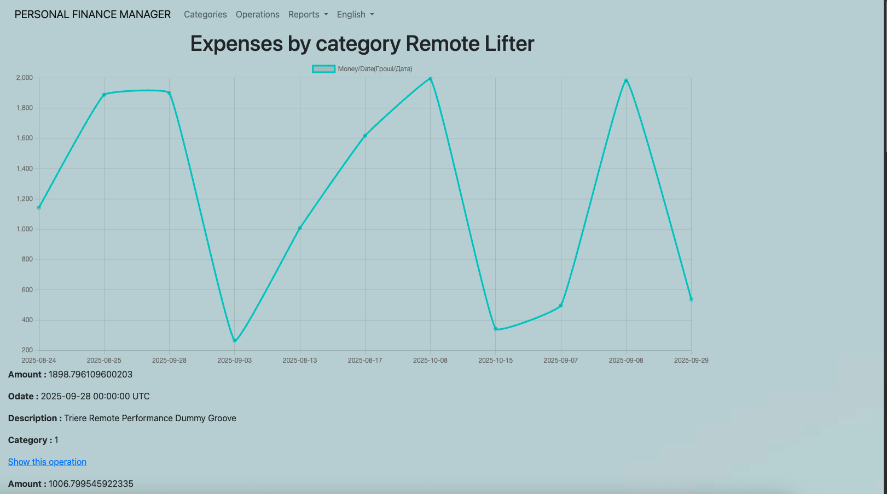
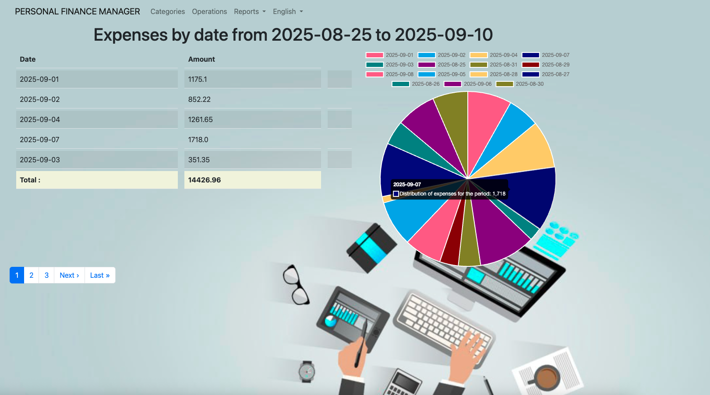
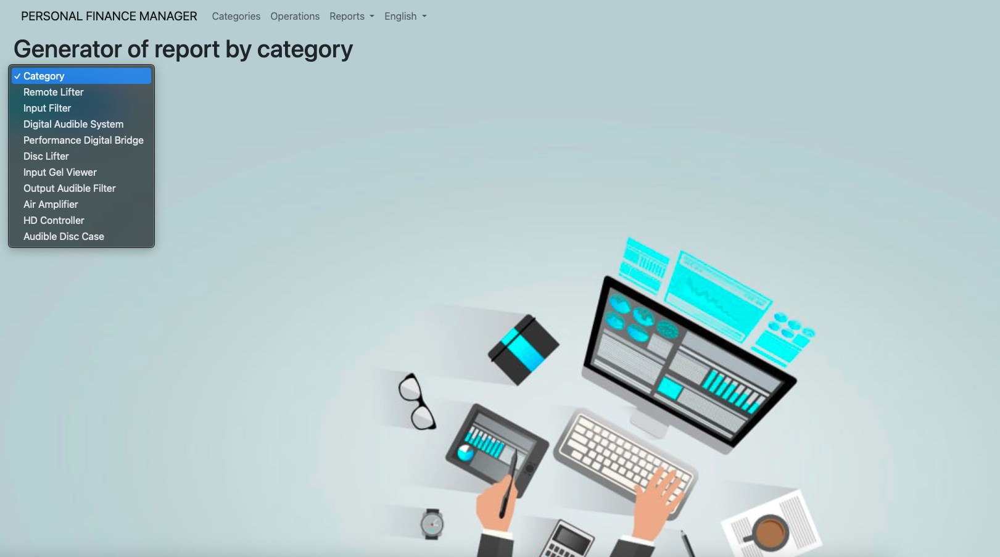
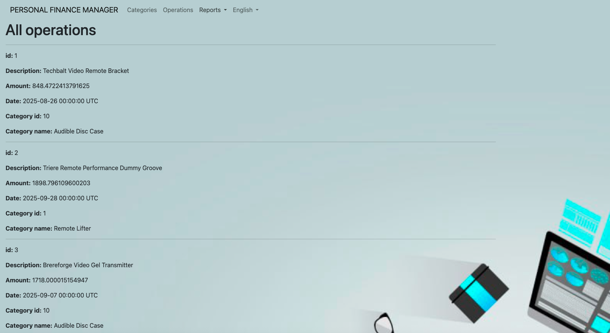
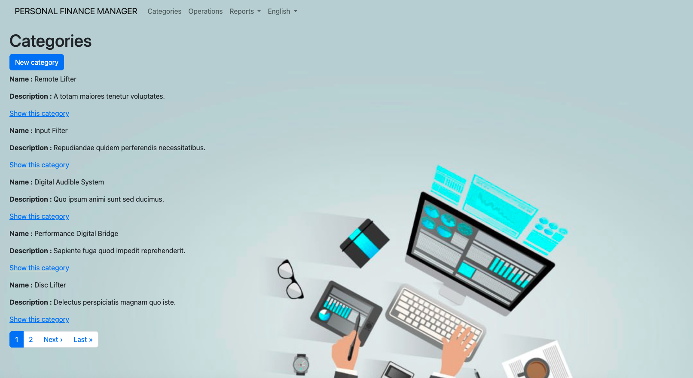

# Personal finance manager
[](https://github.com/yaroslavrick/my_money_app)

## Screenshots:








### Requirements

- Ruby 3.4.7
- Rails 7.2.2

#### 1. Clone the repository

```zsh
https://github.com/yaroslavrick/my_money_app
cd finance_app
```

#### 2. Copy the .env.example file.

```zsh
cp .env.example .env
```

#### 3. Install dependencies

```zsh
bundle
```

#### 4. Setup Docker services (PostgreSQL and Redis):

```zsh
docker-compose up
```

Ensure that the ports configured in `.env` do not conflict with your running services.

Check the PID that use the port 5432:

`sudo lsof -i :5432`

If there is conflict:
Kill that PID:

`sudo kill <PID>`

`sudo service docker start`

`sudo systemctl stop redis postgresql`

`docker-compose up`

If you can't start docker, it can be problem with user permissions:
`sudo gpasswd -a <user> docker`
or:
`sudo usermod -aG docker $USER`

#### 5. Create and setup the database

```zsh
bundle exec rails db:create && bundle exec rails db:migrate && bundle exec rails db:seed
```

#### 6. Start the app

```zsh
bundle exec rails s
```

#### 7. Visit the app at localhost: http://localhost:3000

#### 8. Visit the app at web: https://financeapp-production.up.railway.app/

#### 9. Run RSpec tests:

```zsh
bundle exec rspec
```

## Testing

To run the test suite, use the following command:

```bash
bundle exec rspec
```
